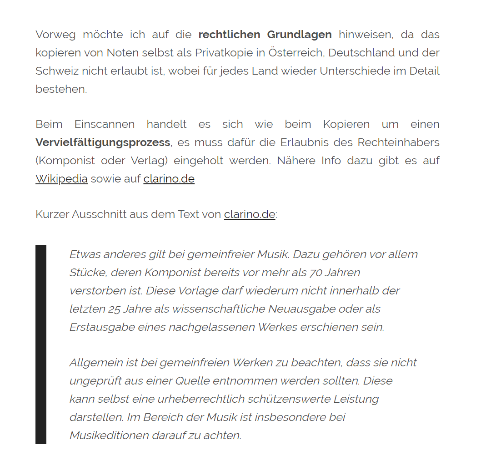

# notenarchive

## Entities

### Per music pieces following fields:

- Id
- Inventar Nummer
- Titel
- Zweiter Titel / Subtitle
- Such Code
- Komponist
- Arrangeur
- Textauthor
- Verlag
- Erscheinungsjahr
- Artikelnummer
- GEMA-Nummer
- Besetzung
- Soloinstrument
- Beschreibung
- Schwierigkeitsgrad
- Spieldauer
- Ausgeteilt
- Verliehen (frei Text nummer)
- Erfassungsdatum
- Kaufdatum
- Preis
- Potpourri
- Sammelheft
- Bemerkung

### Musikrichtung
Verknüpfung von Stücken mit einer Musikrichtung

### Aktuelle Mappe
Verknüpfung von Nummern mit Stücken aus dem Archiv

### Instrumente
Sammlung von alias-Namen per Instrument (z.B: Trompete 1 in B, 1st Trumpet, 1. Tromba, etc..)

### Notenscan
- Scandatum
(mehrere Seiten) verlinkung jeweils zu jeder Seite
Ein Scan eines Musikstückes der einem Instrument zugeordnet wird

### Aktuelle Besetzung
Zusammensetzung von Instrumenten

## Features

### Automatically Assign / Rename scanned images

Bild Dateien können als PDF oder als gesamter Ordner dem Program übergeben werden.

Das Programm kann selbstständig die einzelnen Bilder den Instrumenten zuordnen.
Danach werden die Dateien dementsprechend umbenannt (praktisch für weitere Verarbeitung mit jeglichem anderen Tool.)
Dann werden die Dateien hinterlegt und dementsprechend als Notenscans abgelegt um danach einfach wieder gefunden werden zu können.

### Generierung eines kompletten Ausdrucks einer RegisterStimme der aktuellen Mappe

### Generierung eines kompletten Ausdrucks eines Stücks für die aktuelle Besetzung

## Tools

https://imslp.org/wiki/Hauptseite

https://tesseract.projectnaptha.com/

https://www.electronjs.org/docs/tutorial/boilerplates-and-clis --> https://github.com/electron-react-boilerplate/electron-react-boilerplate

eher für Gitarren/Bands etc: https://www.songbookplus.com/